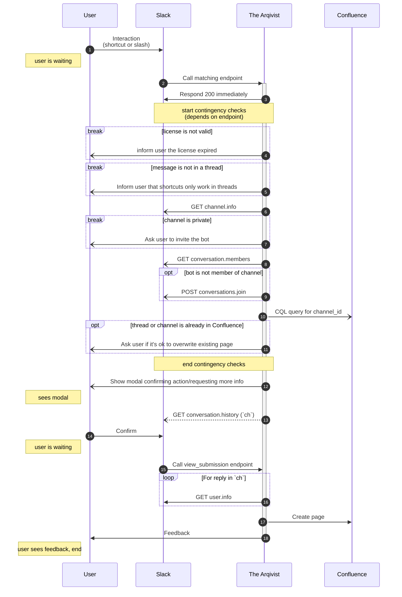

# Technical docs

This page fcouses on how the app works,
and is meant for developers wanting to collaborate.
If any term is unclear, see the [Glossary](glossary.md).

If you want to know _how to use_ the app,
then go to [Getting started](getting_started.md) instead.

## Interacting with Slack

This is a step-by-step diagram of what happens when a user interacts with the app from Slack.

There are two ways to use the bot in Slack:

* Via a [message shortcut :octicons-link-external-16:](https://api.slack.com/interactivity/shortcuts/using#message_shortcuts)
* Via the `/arqive` [slash command :octicons-link-external-16:](https://api.slack.com/interactivity/slash-commands)

The message shortcut is present in the "More actions" or "three dots" button of each message.
At the moment this method is only used for archiving message threads,
because it's not possible to use slash commands within a thread.

Users can add arbitrary text to a slash commands, which makes them more flexible.

* `/arqive help`       shows a message explaining how to use the bot, which actions are available, etc.
* `/arqive`            prompts the archival of the current channel _once_
* `/arqive [schedule]` prompts the _continuous_ archival of the current channel (WIP)

Each of them will target a different endpoint in the app, namely `/slack/shortcut` and `/slack/slash`.

Regardless of the endpoint, or use-case, some conditions must be met in order for the bot to work properly.
We call these `contingencies` internally, and they are checked on each request:

* is the origin of the request a message thread? (used for the shorcut)
* is the channel private?
* is The Arqivist a member of the channel?
* is the current `target` already in Confluence?

If all conditions are met, the user will see a modal for final confirmation of their action.
Otherwise, they will receive a modal informing them that something is wrong,
and they must take some action e.g. invite The Arqivist into the channel manually.

