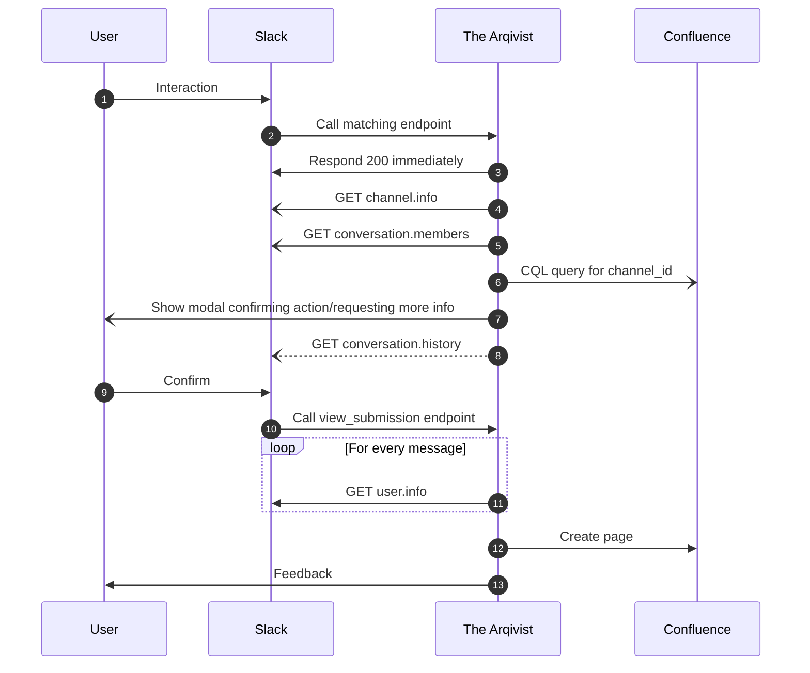

# Internals

## Interacting with Slack

There are two main ways to use the bot in Slack:

* [Message shortcut :octicons-link-external-16:](https://api.slack.com/interactivity/shortcuts/using#message_shortcuts)
* [Slash command :octicons-link-external-16:](https://api.slack.com/interactivity/slash-commands) 

### Message shortcut

### Slash command
